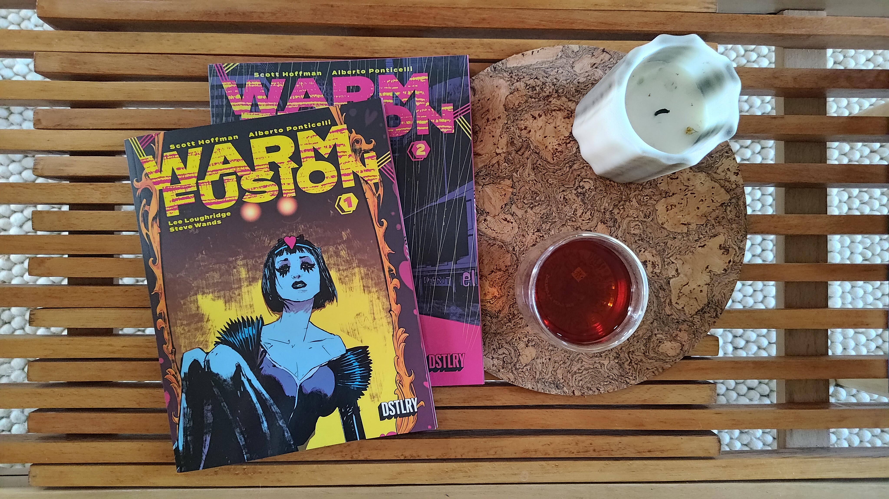

So what if I went back to journaling? To microblogging like it's 2004? Just writing about the mundane things I did on a given day, what I ate, what I read. Humoring the idle musings and dropping cringeworthy one-liners. It's a quaint idea, one that stems from the feeling of intense overdose on news media and entertainment – and a desire to bring back a smaller, more community-oriented web. I want to take part in something with a little more soul. And my hope is that in doing so, I become accustomed to writing frequently and start to combat my fear of imperfection. Here goes.

***

Reading the first two issues of *Warm Fusion*, a sci-fi body horror noir.  This series is the first purchase I've made from [DSTLRY](https://dstlry.co/), a creator-owned comics publisher with an interesting looking collection and a unique business model that centers around limited runs of large-format comics.

I am also enjoying this Qimen Red Tea from [Jesse's Tea House](https://jessesteahouse.com). It's bright and bold, with a sweet and almost floral aftertaste – and could easily become a regular for me.
