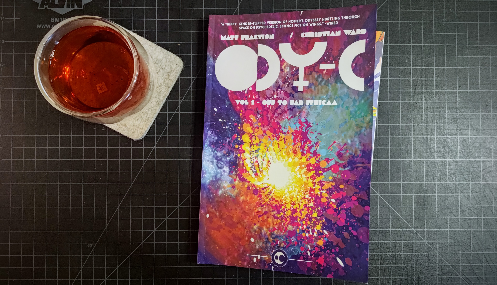

Today I'm revisiting one of the books that got me into comics about five years ago: Matt Fraction and Christian Ward's [*ODY-C*](https://imagecomics.com/comics/series/ody-c). This psypunk gender-bent space opera reimagines the story of *The Odyssey* as playing out in a spacefaring matriarchal society, beautifully illustrated by Ward in a painterly psychedelia that I adore – and recognize as an influence in artists like Greg Tocchini (*Low*, *The Last Days of American Crime*).

This book called out to me at a comic book shop in Portland, OR when I poked in idly while killing time before a brunch reservation. The cover was alluring and that art inside what not what I expected to find in a comic book. I had not really read any since my uncle took me to see a small exhibit on the work of R. Crumb in Oak Park, IL around spring 2010.

Tea today is a rock oolong that I forget the name of and lost the packaging to. I don't think it is the Shui Xian I have enjoyed in the past, but being Yancha, it has a rich, roasty, mineral, and sweet flavor.
