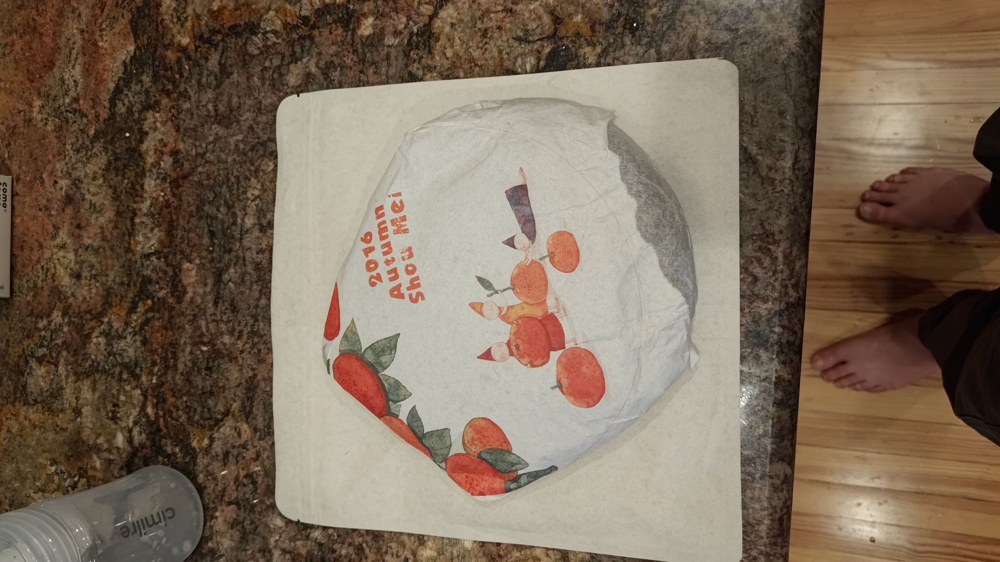
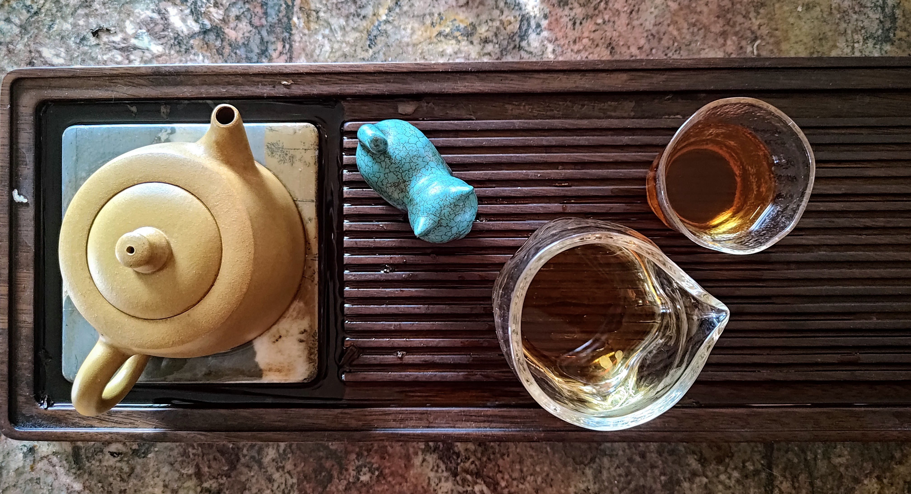
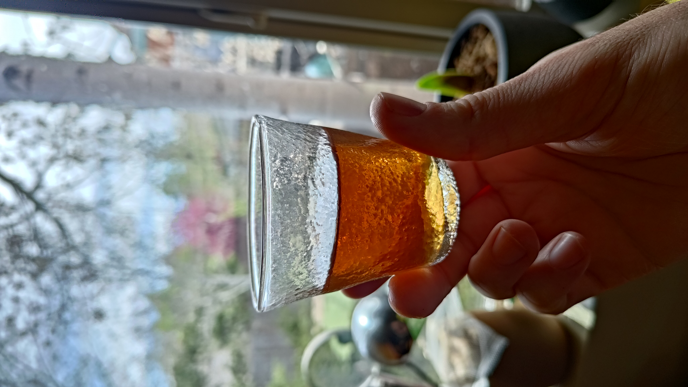

Just stating for the record that I am loving the glass teaware I just acquired from [Kong Mountain Tea](https://www.kongmountaintea.com/). Using a fairness cup and smaller tea glasses makes it even more enjoyable to share a pot or two with a friend. And with clear glass teaware you really can appreciate the appearance of the tea so much better.

This 2016 Shou Mei is a surprisingly affordable (though quite unprocessed) white tea I picked up from the same shop. It is pretty twiggy, but has a clean and clear liquor and easily steeps 8 or 10 times. Dang I love white tea.