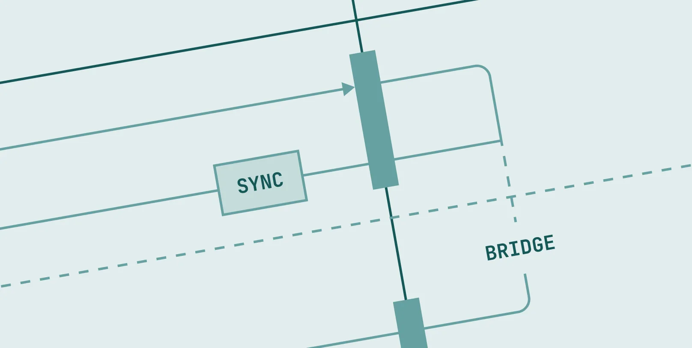
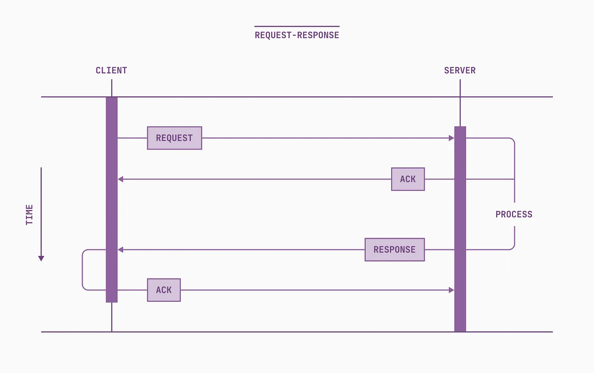
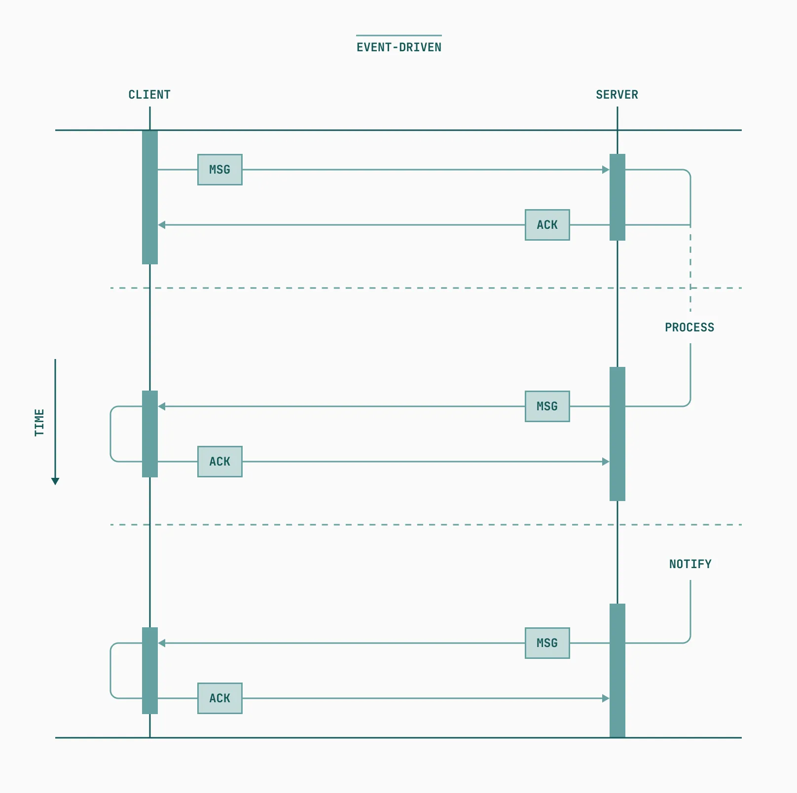

Event-driven architecture (EDA) is a powerful way of building loosely coupled, performant, scalable apps on the web. It enables rich experiences like push notifications, collaborative editing and multiplayer, and other real-time interactions, and encourages modularity.

But sometimes the model is inconsistent with what we as developers need to do. When two application layers can only communicate via asynchronous message passing, we can be forced to structure our code awkwardly. We can’t collocate the requesting code with the receiving code, and are responsible for managing listeners or subscriptions ourselves.

In this article, I’ll demonstrate a general solution to adapt event-based APIs into convenient, Promise-based APIs that hide the complexity and boilerplate of message passing, and allow you to write linear code across application boundaries.

***

# Request/Response vs. EDA

Traditional applications on the web handle communication across boundaries over HTTP — via REST, GraphQL, RPC, and other specifications following the request/response model. This model is characterized by a requester sending a message, then waiting for a responder to receive, process, and reply to the message before continuing execution. Though this may take place in `async` functions in JavaScript, we can refer to this model as generally “synchronous” or “in-band,” in that a response is expected immediately following a request, and that the context executing the request will wait for it.




In EDA, also called the **publish/subscribe** model, the processes of requesting and receiving data are separate and performed in a non-blocking, asynchronous manner. Typically a client will subscribe to messages from a server, and a server will subscribe to messages from the client. When a client requests data, it simply *sends a message*, then carries on with its execution. The server receives this message, processes it, and at some point sends another message to the client. The client, as a subscriber, receives this message “out-of-band” from its original request, and processes the message as it sees fit. Critically, this can happen at another time, using a different network request, or even another protocol.

> *Take this analogy — the request/response model is a phone call between two friends, and pub/sub is a group text: not every message is meant for you, and you can decide which messages to respond to and when — though you are expected to eventually respond to certain messages. In 2023, texting or other asynchronous messaging is usually the right mode of communication. But sometimes you just need to pick up the phone.*



A few key advantages arise in the capabilities of the event-driven model. First, EDA allows clients to *be notified* of events on the server, regardless of having asked for it. This eliminates expensive polling, and enables “push” behavior for notifications and events originating elsewhere. Second, it can encourage less coupled code by allowing message handling to be separated from message sending. Third, it empowers developers to parallelize processing and build resilient, comprehensible systems. Fourth, it makes systems inherently fault-tolerant, as only recognized messages are handled by subscribers.

Web technologies like [Webhooks](https://www.getvero.com/resources/webhooks/), [WebSockets](https://developer.mozilla.org/en-US/docs/Web/API/WebSockets_API), and [Server-Sent Events](https://developer.mozilla.org/en-US/docs/Web/API/Server-sent_events/Using_server-sent_events), protocols like [MQTT](https://mqtt.org/) and [AMQP](https://www.amqp.org/), and numerous tools built on top of these can all be used to implement robust event-driven applications today.

***

# When EDA gets in the way

In complex apps, event-driven architectures can provide tons of advantages. But sometimes you need the data *right away*, in a specific execution context. And sometimes we simply want to treat a remote resource or procedure as if it is a local one.

As a somewhat contrived example, let’s say we have an application that has to perform some expensive computation on user input. We decide that this computation is best done in a [Web Worker](https://developer.mozilla.org/en-US/docs/Web/API/Web_Workers_API), which uses a separate thread to do the work without burning cycles on the main UI thread. We set up some simple logic to communicate with a worker from our app:

```javascript
// index.js

const worker = new Worker("worker.js");

// Send message to the worker when button is clicked
const btn = document.getElementById("btn");
btn.addEventListener("click", () => {
  worker.postMessage({ type: "expensiveComputation", payload: 42 });
});

// Handle incoming messages from the worker
worker.addEventListener("message", (event) => {
  const { type, payload } = event.data;
  switch(type) {
    case "expensiveComputation":
      doSomethingWithResult(payload);
      break;

    default:
      break;
  }
});
```

Our Worker module listens for messages from the main thread, performs the expensive computation, and sends a response to the main thread with the result:

```javascript
// worker.js

// Handle incoming messages from the main thread
self.onmessage = async (event) => {
  const { type, payload } = event.data;
  switch(type) {
    case "expensiveComputation":
      const result = await doExpensiveComputation(payload);
      postMessage({ type, payload: result });
      break;

    default:
      break;
  }
};
```

This does what we expect. The client can send a request for a computation, then later receive the result and `doSomethingWithResult`. But this solution limits us in terms of *where* we can perform an `expensiveComputation`. We can’t *request and use the response* in the same place. This can pose a challenge when trying to use the functionality from contexts we have little control over, like external library code, or in the middle of an `async` function. It would be nice to be able to say, “I need this data, and I’ll wait for it right here.”

Enter the Sync Bridge.

***

# The Sync Bridge

In order to consume the event stream in a “synchronous” manner, we’ll need to convert its interface into one using Promises — a Sync Bridge. The process of converting an event-based API to a `Promise`-based one can be broken down into a few steps:

1. Before a message is sent from the client, attach an `id` or some means of uniquely identifying the requester to the message. This is our “return address.”
1. Create an “empty” `Promise` and store a reference to its `resolve` and `reject` callbacks, associated to the message’s `id`, in some pending data structure. A `Map` is a good choice.
1. Return the `Promise` to the requester, and send the message.
1. Subscribe to client messages on the host. When a message bearing an `id` is received, process it as usual, but include the same `id` on the response message.
1. Subscribe to host messages on the client. When a message bearing an `id` is received, check to see if `pending` contains any pending promises for that `id`. If it does, pop it from the data structure and resolve or reject the `Promise`, whatever is appropriate based on the contents of the host message.

Here “client” and “host” can be any entity that participates in message passing. Sometimes a client can act as a host and vice versa, so we can also refer to these entities as “requester” and “responder” based on the context in which they are used.

We can escape the limitations of EDA by creating a contract between the client and host, agreeing to mark request and corresponding response messages with a common, unique ID, enabling responses to be “routed” to the right requester. We leave a Promise open on the request side as a placeholder, which we fill in with real data once the message we are waiting on is received.

To apply this to our earlier Web Worker example, let’s write some helper classes to abstract the processes listed above. We’ll want some sort of client abstraction to assign IDs to messages, keep track of pending requests, and listen for responses. We’ll call this a WorkerClient:

```javascript
// worker-client.js

const DEFAULT_CHANNEL = "__worker_channel";

/**
 * A client for interacting with a Web Worker via async requests.
 */
export class WorkerClient {
  #channel;
  #worker;
  #receiver;
  #pending = new Map();

  constructor(workerUrl, channel = DEFAULT_CHANNEL) {
    // Using a named channel will allow us to keep logic for sending and receiving
    // messages of a certain type scoped to specific consumers, and allow us to create
    // multiple independent channels.
    this.#channel = channel;

    // The client manages a worker internally
    this.#worker = new Worker(workerUrl, { type: "module" });

    // The client listens for messages on this channel. When it sees a message
    // corresponding to one of its pending Promises, it resolves or rejects that
    // Promise with the receivced payload.
    this.#receiver = (event) => {
      if (!event.data || !event.data.id) return;
      if (event.data.channel !== this.#channel) return;
      if (!this.#pending.has(event.data.id)) return;

      const [resolve, reject] = this.#pending.get(event.data.id);
      if ("payload" in event.data) {
        resolve(event.data.payload);
      } else if ("error" in event.data) {
        reject(event.data.error);
      } else {
        reject(new Error("Malformed response"));
      }
      this.#pending.delete(event.data.id);
    };

    this.#worker.addEventListener("message", this.#receiver);
  }

  async post(payload) {
    // Create a pseudo-random ID for this request, so we can identify corresponding
    // messages from the host when they arrive. This does not need to be crypto-safe,
    // but should be "unique enough" to prevent collisions when making simultaneous
    // requests. Could also be an incrementing counter.
    const id = Math.floor(Math.random() * 1_000_000).toString(16);
    
    // Create an "empty" Promise and store a reference to it locally, identified by
    // its ID. This Promise is returned to the caller, and later resolved or rejected
    // based on receipt of a corresponding message from the Worker.
    return new Promise((resolve, reject) => {
      this.#pending.set(id, [resolve, reject]);
      
      // Dispatch a message to the worker
      this.#worker.postMessage({
        id,
        channel: this.#channel,
        payload,
      });
    });
  }
}
```

On the host side, we’ll want a controller that filters out the messages we’re not interested in, performs some unit of work, and sends messages back to the requester’s “return address.” A proxy message handler, if you will. We’ll call this `WorkerHost`:

```javascript
// worker-host.js

/**
 * A Worker-based channel for communicating with a main-thread WorkerClient.
 */
 export class WorkerHost {
  #channel;
  #receivers = new Map();

  constructor(channel = DEFAULT_CHANNEL) {
    this.#channel = channel;
  }

  // Register an event listener that only receives messages on this channel
  on(type = "message", callback) {
    const wrapper = async (event) => {
      // Filter out irrelevant messages
      if (!event.data || !event.data.id) return;
      if (event.data.channel !== this.#channel) return;
     
      try {
        // Execute the callback and send a reply message with the result
        const payload = await callback(event);
        postMessage({
          id: event.data.id,
          channel: this.#channel,
          payload,
        });
      } catch (error) {
        // Handle errors and return them in a message
        postMessage({
          id: event.data.id,
          channel: this.#channel,
          error,
        });
      } 
    };

    this.#receivers.set(callback, wrapper);
    addEventListener(type, wrapper);
  }

  // A convenience for unsubscribing to client messages
  off(type = "message", callback) {
    const wrapper = this.#receivers.get(callback);
    if (wrapper) {
      removeEventListener(type, wrapper);
      this.#receivers.delete(callback);
    }
  }
}
```

Using these helpers, we’ll rewrite our application code to consume our new Promise-based API. Note that we can now `await` the data directly in our click handler:


```javascript
// index.js

import { WorkerClient } from "./worker-client.js";

const client = new WorkerClient("worker.js");

// Request data from the worker as if it exposed a Promise-based API
const btn = document.getElementById("btn");
btn.addEventListener("click", async () => {
  const data = await client.post({
    type: "expensiveComputation",
    payload: 42,
  });
  doSomethingWithResult(data);
});
```

Our worker looks quite similar too, with the exception that our handlers are now just returning values instead of posting messages (the message passing is taken care of for us):

```javascript
// worker.js

const host = new WorkerHost();

// Handle messages from the main thread
// NOTE: we can skip checking channel and message ids ourselves,
// as the wrapper has already filtered them out for us!
host.on("message", async (event) => {
  const { type, payload } = event.data;
  switch(type) {
    case "expensiveComputation":
      const result = await doExpensiveComputation(payload);
      // Just return a value here. Thrown errors will also be returned to the client.
      return result;

    default:
      break;
  }
});
```

OK, we’ve written a fair amount of code. What exactly have we gained?

The Sync Bridge adaptor essentially reframes the *expectation of receiving some message in the future* as an actual `Promise`. It allows us to treat data and code in a remote context as if it were local. Most importantly, it allows us to request and use remote data in the same place. If we need to do an `expensiveComputation` in the middle of a database transaction, some arbitrary event handler, or even in the message handler of another event stream, *we just pick up the phone*.

We can also now restrict messages of different types to discrete channels, keeping message handling specific, fast, and localizing code to only where it is needed. If we want, multiple `WorkerClient` objects can even share the same channel.

This pattern can be easily generalized to most event-driven systems. We could modify the helpers in our example to take in any `EventTarget` instead of constructing its own `Worker`, providing a generic, synchronous interface to any message stream. Or we could write drop-in wrapper libraries for specific interfaces, as I recently did with [figments](https://github.com/rektdeckard/figments) — a set of “bridged” wrappers around event-driven parts of the Figma Plugin API.

> Side note: if there’s an existing term for the technique we’ve applied here — adapting an event-based asynchronous interface to a promise/future-based one — please let me know in the comments! Until then, I will continue to call it a “Sync Bridge.”

# In the real world

While it is best to start “thinking in events” when working with event-driven systems, you sometimes need an escape hatch. A Sync Bridge can be a useful tool here, but consider if this approach is necessary before implementing it. Mostly, eventing just works.

Hope you have an… eventful day!

***

# Further reading and resources

**Example code from this article**

- [rektdeckard/promisize](https://github.com/rektdeckard/promisize)

**More on EDA**

- [Event-driven APIs – Understanding the Principles](https://medium.com/event-driven-utopia/event-driven-apis-understanding-the-principles-c3208308d4b2)
- [What the heck is event-driven architecture?](https://dev.to/architectio/what-the-heck-is-event-driven-architecture-1j32)

**Deep dives into async/await, events, and Promises**

- [What the heck is the event loop anyway?](https://youtu.be/8aGhZQkoFbQ)
- [Loupe](http://latentflip.com/loupe)
- [sindresorhus/promise-fun](https://github.com/sindresorhus/promise-fun)

🙏 Thanks to [Helena Zhang](https://helenazhang.com) for being my illustrator and rubber duck, and to [Tariq Rauf](https://tariq.co/) for giving this pattern a name.
